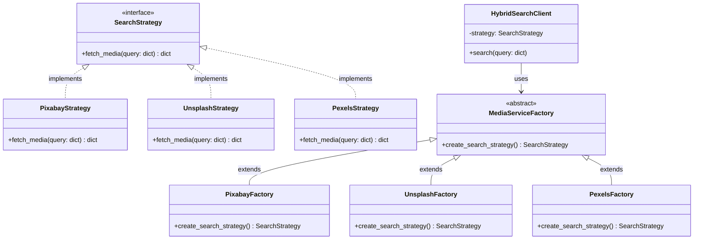

<h2 align="center">Media Searcher Package</h2>

<p align="center">
<a href="https://github.com/psf/black"></a>
</p>
<p align="center">
  Multi-platform supported.
</p>


# MediaSearcher

## 简介

MS是一个利用不同API提供商（如Pixabay、Unsplash、Pexels等）获取图片和视频的Python库。它允许用户通过统一的接口搜索不同源的媒体内容，支持异步搜索以提高性能，同时为将来可能集成的本地视觉模型和基于搜索引擎+AI的检索提供了扩展性。

## 功能特性

- **支持多个API提供商**：集成了多个流行的媒体内容API，如Pixabay、Unsplash和Pexels。
- **异步搜索**：利用Python的异步能力，支持非阻塞的并发搜索。
- **可扩展设计**：采用**策略模式**和**工厂模式**，易于添加新的媒体内容提供商或搜索策略。
- **参数适配**：对于不同API接受的参数差异，提供了灵活的适配器来处理。(TODO)

## 安装指南

```bash
git clone https://github.com/rickywesker/MediaSearcher.git
cd MediaSearcher
pip install -r requirements.txt
```

## 使用方法

使用媒体搜索客户端进行搜索的基本步骤如下：

1. **初始化客户端**：选择合适的API提供商和API密钥初始化客户端。
2. **执行搜索**：传入搜索参数，执行异步搜索操作。
3. **处理结果**：获取搜索结果并进行处理。(TODO:目前为Raw content)

```python
from MediaSearcher import SearchClient
from dotenv import load_dotenv
import os

load_dotenv()

pixabay_params = {"provider":"pixabay","key":os.getenv("PIXABAY_KEY")}
unsplash_params = {"provider":"unsplash","key":os.getenv("UNSPLASH_KEY")}
pexels_params = {"provider":"pexels","key":os.getenv("PEXELS_KEY")}

search_cli = SearchClient(param)
#async mode
images = await search_cli.asearch(params, 'hybrid')

#sync mode
images = search_cli.search(params, 'hybrid')

```

## 代码结构




## 贡献指南

欢迎对项目做出贡献！如果你有好的意见或建议，请遵循以下步骤：

1. Fork 仓库。
2. 创建新的分支 (`git checkout -b feature/AmazingFeature`)。
3. 提交更改 (`git commit -m 'Add some AmazingFeature'`)。
4. 推送到分支 (`git push origin feature/AmazingFeature`)。
5. 打开 Pull Request。

## 许可证

本项目采用MIT许可证。详情请见[LICENSE](LICENSE)文件。

## 致谢

- [Pixabay](https://pixabay.com/)
- [Unsplash](https://unsplash.com/)
- [Pexels](https://www.pexels.com/)

